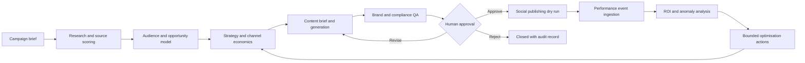

# Agentic AI for Digital Marketing

Course code: **TGS-2025056988**  
Provider: **Tertiary Infotech Academy Pte. Ltd.**

This repository contains the learner-safe technical courseware for a two-day programme on building governed, measurable digital-marketing automations with n8n. The connected lab sequence takes a campaign from evidence-led research through strategy, content production, brand and claim checks, human approval, social-publishing dry runs, attribution, and optimisation.

## Automation architecture

All publishing exercises default to a safe dry-run pattern. Learners must supply and secure their own credentials if adapting the workflows to external platforms.

## Repository contents

- `courseware/` — trainer PowerPoint, learner-facing slide PDF, Learner Guide, and Lesson Plan.
- `labs/` — 15 self-contained n8n labs with importable workflow JSON, synthetic Excel data, evidence checklists, starter notes, and expected outputs.
- `LG-Agentic AI for Digital Marketing.md` — accessible source version of the Learner Guide.

## Connected lab journey

| Lab | Outcome |
|---:|---|
| 01 | Capture a campaign brief and define a KPI contract |
| 02 | Research and score evidence sources |
| 03 | Synthesize audience signals and rank opportunities |
| 04 | Produce a RACE/SOSTAC strategy model |
| 05 | Simulate channel budget, unit economics, and ROI |
| 06 | Build a campaign backlog and experiment design |
| 07 | Convert strategy into a governed content prompt contract |
| 08 | Generate a multi-channel content package |
| 09 | Apply brand, claim, and compliance checks |
| 10 | Implement a human-approval state machine |
| 11 | Execute idempotent social-publishing dry runs |
| 12 | Orchestrate the end-to-end campaign flow |
| 13 | Ingest performance events and attribute outcomes |
| 14 | Build an ROI dashboard and anomaly detector |
| 15 | Complete the governed optimisation-loop capstone |

## Lab use

Open a lab folder, read its `README.md`, import `workflow.json` into n8n, and use the workbook in `data/`. Each workbook is synthetic and includes a data dictionary. Keep all credentials in n8n Credentials or another secret manager; never paste secrets into a workflow export.

## Privacy and assessment boundary

Trainer answer keys, learner submissions, credentials, reference ebooks, build files, and internal QA evidence are intentionally excluded from this public repository.

