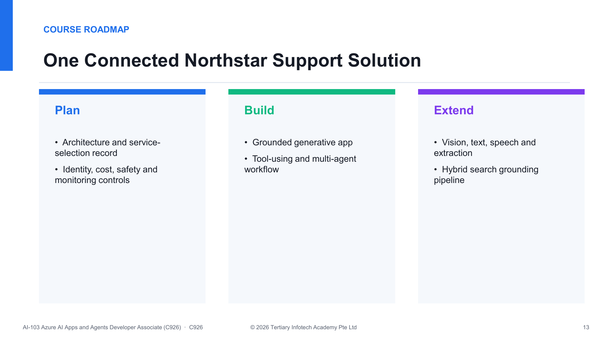

<div align="center">

# AI-103 Microsoft Certified Azure AI Apps and Agents Developer Associate

[](https://www.tertiarycourses.com.sg/ai-103-microsoft-certified-azure-ai-apps-and-agents-developer-associate.html)
[](https://learn.microsoft.com/en-us/azure/foundry/)
[](https://www.python.org/)
[](https://learn.microsoft.com/en-us/credentials/certifications/azure-ai-apps-and-agents-developer-associate/)
[](#license)

**Aligned courseware and nine connected Northstar labs for planning, building, grounding, securing and operating Azure AI apps and agents with Microsoft Foundry.**

[📘 Course Page](https://www.tertiarycourses.com.sg/ai-103-microsoft-certified-azure-ai-apps-and-agents-developer-associate.html) · [📖 Learner Guide](LG-AI-103%20Azure%20AI%20Apps%20and%20Agents%20Developer%20Associate%20%28C926%29.md) · [🐛 Report Bug](https://github.com/tertiarycourses/C926-AI-103-Microsoft-Certified-Azure-AI-Apps-and-Agents-Developer-Associate/issues) · [💡 Request Feature](https://github.com/tertiarycourses/C926-AI-103-Microsoft-Certified-Azure-AI-Apps-and-Agents-Developer-Associate/issues)



</div>

> [!NOTE]
> These are the courseware and hands-on lab materials for **C926 — AI-103 Microsoft Certified Azure AI Apps and Agents Developer Associate**, delivered by Tertiary Courses / Tertiary Infotech. The two-day schedule contains 15 instructional hours plus tea breaks; lunch is excluded.

---

## Lab Activities

| Lab | Connected Northstar outcome | Duration |
|---:|---|---:|
| [1](labs/lab-01-design-the-northstar-foundry-solution.md) | Design the Foundry solution and architecture decision record | 45 min |
| [2](labs/lab-02-verify-foundry-access-and-the-operations-baseline.md) | Verify keyless project access and the operations baseline | 60 min |
| [3](labs/lab-03-build-and-test-a-grounded-generative-app.md) | Build and evaluate an evidence-bounded generative app | 75 min |
| [4](labs/lab-04-build-a-tool-using-agent-with-approval-control.md) | Build a tool-using agent with explicit human approval | 90 min |
| [5](labs/lab-05-design-multi-agent-routing-and-quality-gates.md) | Test contract-driven routing and release gates | 60 min |
| [6](labs/lab-06-build-a-responsible-multimodal-workflow.md) | Produce a traceable, accessible and policy-checked visual packet | 75 min |
| [7](labs/lab-07-implement-a-text-translation-and-speech-pipeline.md) | Validate text, translation and speech evidence | 75 min |
| [8](labs/lab-08-extract-invoice-evidence-with-content-understanding.md) | Extract and validate invoice evidence with Content Understanding | 90 min |
| [9](labs/lab-09-build-and-verify-a-hybrid-grounding-pipeline.md) | Compare keyword, vector and hybrid retrieval and ground the final response | 90 min |

Each lab starts from the preceding checkpoint. Editable learner work stays in `C926-labs/`; reusable master resources remain unchanged under [`labs/resources/`](labs/resources/).

---

## About

This repository contains the complete, aligned learning package for **C926**: an 86-slide concept-first deck, a self-contained Learner Guide, a timed Lesson Plan and nine executable labs. One Python source model drives the PPT, LG, LP and lab documents so topic names, learning outcomes, sequence, timing and checkpoints remain synchronized.

The content follows the five current AI-103 domains:

| Domain | Course coverage | Labs |
|---|---:|---|
| Plan and Manage an Azure AI Solution | 25–30% | 1–2 |
| Implement Generative AI and Agentic Solutions | 30–35% | 3–5 |
| Implement Computer Vision Solutions | 10–15% | 6 |
| Implement Text Analysis Solutions | 10–15% | 7 |
| Implement Information Extraction Solutions | 10–15% | 8–9 |

> 📖 **Full walkthrough:** start with the [Learner Guide](LG-AI-103%20Azure%20AI%20Apps%20and%20Agents%20Developer%20Associate%20%28C926%29.md). Slides, PDF exports, the Lesson Plan and the Word Learner Guide are in [`courseware/`](courseware/).

---

## Tech Stack

| Category | Technology |
|---|---|
| AI platform | Microsoft Foundry projects, deployed models, Responses API, evaluations and tracing |
| Agent framework | Microsoft Agent Framework with typed tools, invocation caps and approval interrupts |
| Grounding | Azure AI Search keyword, vector, hybrid and semantic retrieval |
| Multimodal | Foundry image tools and multimodal understanding workflows |
| Language | Azure Speech, Translator and structured Foundry model responses |
| Extraction | Azure AI Content Understanding with the `prebuilt-invoice` analyzer |
| Identity | Microsoft Entra ID, Azure CLI credentials and scoped Azure roles |
| Runtime | Python 3.12 with a tested dependency lock file |
| Courseware | `python-pptx`, `python-docx`, PowerPoint/Word PDF export and automated QA |

---

## Architecture

```text
DAY 1 — PLAN + BUILD
  Lab 1  Scenario ─▶ architecture decision record ─▶ identities and controls
  Lab 2  Foundry project ─▶ keyless verifier ─▶ deployment/trace baseline
  Lab 3  Policy corpus ─▶ retrieval ─▶ grounded response ─▶ quality rubric
  Lab 4  Request lookup ─▶ agent ─▶ approval interrupt ─▶ synthetic draft
  Lab 5  Contract router ─▶ specialist ─▶ trace/error analysis ─▶ release gate

DAY 2 — EXTEND + OPERATE
  Lab 6  Visual source ─▶ evidence-first analysis ─▶ accessibility/policy packet
  Lab 7  Transcript/audio ─▶ structured record ─▶ speech/translation review
  Lab 8  Synthetic invoice ─▶ Content Understanding ─▶ validated fields
  Lab 9  Search index ─▶ keyword/vector/hybrid ─▶ cited answer ─▶ monitoring

  Every checkpoint ─▶ C926-labs/evidence/manifest.md ─▶ final ADR
```

---

## Project Structure

```text
C926-AI-103-Microsoft-Certified-Azure-AI-Apps-and-Agents-Developer-Associate/
├── README.md
├── LG-AI-103 Azure AI Apps and Agents Developer Associate (C926).md
├── screenshot.png
├── courseware/
│   ├── AI-103 Azure AI Apps and Agents Developer Associate (C926)-v1.0.pptx
│   ├── AI-103 Azure AI Apps and Agents Developer Associate (C926)-v1.0.pdf
│   ├── LG-AI-103 Azure AI Apps and Agents Developer Associate (C926).docx/.pdf
│   └── LP-AI-103 Azure AI Apps and Agents Developer Associate (C926).docx/.pdf
├── labs/
│   ├── README.md
│   ├── lab-01-*.md … lab-09-*.md
│   └── resources/                 # scripts, schemas, templates and rejoin evidence
├── reference/SOURCES.md           # authoritative product and AI-103 sources
└── .agents/skills/non-wsq-courseware-build/
    └── build/                     # single-source generators and course data
```

---

## Getting Started

### Prerequisites

- Python 3.12
- Azure CLI
- An instructor-provided Microsoft Foundry project and model deployment
- The scoped roles and optional service resources listed in [`labs/resources/instructor-readiness-manifest.md`](labs/resources/instructor-readiness-manifest.md)

### 1. Clone the repository

```powershell
git clone https://github.com/tertiarycourses/C926-AI-103-Microsoft-Certified-Azure-AI-Apps-and-Agents-Developer-Associate.git
Set-Location C926-AI-103-Microsoft-Certified-Azure-AI-Apps-and-Agents-Developer-Associate
```

### 2. Start with Lab 1

Open [Lab 1](labs/lab-01-design-the-northstar-foundry-solution.md). It creates the ignored `C926-labs/` workspace, copies the ADR/checkpoint templates and establishes the file locations reused by every later lab.

### 3. Install the tested environment in Lab 2

```powershell
Set-Location C926-labs
python -m venv .venv
.\.venv\Scripts\python.exe -m pip install -r ..\labs\resources\requirements-lock.txt
Copy-Item ..\labs\resources\.env.example .env
```

Use Microsoft Entra authentication where supported. Keep `.env`, keys, tokens, private endpoints and raw traces out of Git and shared evidence.

---

## Contributing

Contributions, fixes and improvements are welcome:

1. Fork the repository.
2. Create a feature branch.
3. Make changes in the single source under `.agents/skills/non-wsq-courseware-build/build/` and the reusable lab resources.
4. Regenerate all artifacts and run the non-WSQ QA checks.
5. Open a pull request with the validation evidence.

Found a bug or have an idea? Open an [issue](https://github.com/tertiarycourses/C926-AI-103-Microsoft-Certified-Azure-AI-Apps-and-Agents-Developer-Associate/issues).

---

## License

This material is provided for **educational use** as part of course **C926**. © Tertiary Infotech Academy Pte. Ltd. All rights reserved.

---

## Developed By

**Tertiary Infotech Academy Pte. Ltd.** — [Tertiary Courses](https://www.tertiarycourses.com.sg)
Course: [AI-103 Microsoft Certified Azure AI Apps and Agents Developer Associate (C926)](https://www.tertiarycourses.com.sg/ai-103-microsoft-certified-azure-ai-apps-and-agents-developer-associate.html)

## Acknowledgements

- [Microsoft Learn](https://learn.microsoft.com/) — AI-103 skills outline and Azure product documentation
- Microsoft Foundry, Azure AI Search, Agent Framework, Content Understanding, Speech and Translator product teams
- Course trainers and learners who improve the connected Northstar scenario

---

<div align="center">

⭐ **If these materials help you build reliable Azure AI apps and agents, star the repository.**

Powered by [Tertiary Infotech Academy Pte Ltd](https://www.tertiaryinfotech.com/)

[📘 Course Page](https://www.tertiarycourses.com.sg/ai-103-microsoft-certified-azure-ai-apps-and-agents-developer-associate.html) · [📖 Learner Guide](LG-AI-103%20Azure%20AI%20Apps%20and%20Agents%20Developer%20Associate%20%28C926%29.md)

</div>
